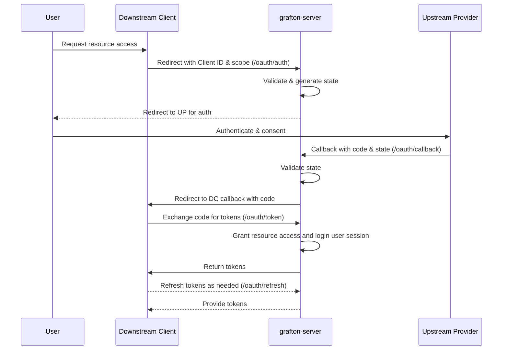

# Introduction

This document describes the authentication and authorization process between downstream clients (e.g., OpenAI) and an upstream OAuth provider (such as Google, GitHub, or Microsoft) for authenticating grafton-server API requests for Downstream Clients end users. By managing OAuth flows `grafton-server` enables downstream client users to authenticate and authorize API calls seamlessly.

## OAuth Features of grafton-server

- Acts as a bridge for OAuth authentication and authorization between users and upstream providers.
- Manages and proxies authentication tokens securely.
- Handles user sessions for API calls authorization.

## Operation Flow

### Registration of Downstream Clients

- **Initial Setup**: Downstream Clients (DCs) register with `grafton-server` to receive a unique Client ID and Client Secret. They also need to provide their callback URLs. This setup is done out of band and prior to any OAuth flow.

### User-Initiated Authorization Flow

1.  **Resource Request**: When users request access to grafton-server resources, DCs direct users to the `grafton-server` authorization endpoint (/oauth/auth) with their Client ID and requested scope.

        OpenAI specific example. OAuth requests will make a request to the grafton-server authorization endpoint with the following parameters:

        [grafton_auth_url]?response_type=code&client_id=[client_id]&scope=[scope]&state=xyz123&redirect_uri=https%3A%2F%2Fchat.openai.com%2Faip%2F[plugin_id]%2Foauth%2Fcallback

2. The authorization endpoint returns a web page with login buttons for each of the supported upstream providers. The user presses the button for their desired upstream provider which submits a POST request to the grafton-server's /login/:provider handler.

3.  **Upstream Provider Redirection**: `grafton-server`'s /login/:provider handler validates the request, creates a state parameter for CSRF protection, and redirects users to the upstream provider for authorization. The client's downstream redirect_uri is stored in the session to be used later amd the grafton-server's upstream callback endpoint (/oauth/:provider/callback) is used as the redirect_uri for the upstream provider.

4.  **Authorization Code Exchange**: The upstream provider redirects to the `grafton-server` callback with an authorization code. `grafton-server` verifies the state and returns the authorization code and state to the DC's downstream callback redirect_uri.

5.  **Token Exchange**: The DC makes a request to exchange the code for access/refresh tokens grafton-server initiates a session. While the session is usually expected to be identified by a bearer token on each request, the api server could also use session cookies if the DC also supports persistent client cookie jars.

        OpenAI specific example.  ChatGPT will complete the OAuth flow by making a POST request to the authorization_url with content type authorization_content_type and parameters
        {
            “grant_type”: “authorization_code”,
            “client_id”: [client_id],
            “client_secret”: [client_secret],
            “code”: [the code that was returned with the redirect],
            “redirect_uri”: [the same redirect uri as before]
        }

        The endpoint should return a response that looks like:
        {
            "access_token": "example_token",
            "token_type": "bearer",
            "refresh_token": "example_token",
            "expires_in": 59
        }

6.  **Refresh Token Flow**:

When grafton-server initially exchanges an authorization code for access and refresh tokens from an upstream provider, it must securely store the refresh token associated with the downstream client and user session. When a DC requests a token refresh grafton-server looks up the stored refresh token for that session or client ID and forwards the refresh request to the upstream provider, including the refresh token and its own client credentials if required. Upon receiving new tokens from the upstream provider, grafton-server updates its storage with the new access and refresh tokens and forwards these to the requesting DC.

### Token Management

- **Token Usage**: DCs use the obtained tokens to make authorized API calls on the user's behalf.
- **Token Refresh**: DCs can request `grafton-server` for token refreshes as needed.

### Sequence Diagram

All diagrams must be created using the Mermaid diagramming language. The diagrams must be clear, easy to understand, and visually appealing. The diagrams must also adhere to the following requirements:

The sequence diagram visually represents the interactions between the four primary actors: User, Downstream Client, grafton-server, and Upstream Provider. Key requirements include:

- **Actors and Systems**: Clearly defines columns or lanes for each actor (User, DC, grafton-server, Upstream Provider).
- **Flow of Interactions**: Uses arrows to depict the sequence of steps, from the initial user request to the final access of protected resources.
- **Decision Points**: Includes decision nodes, such as validation of the Client ID, state parameter, and user consent.
- **Token Exchange**: Illustrates the exchange of authorization codes for access tokens and the optional storage of these tokens.
- **Security Measures**: Highlights security-related steps, such as HTTPS communications, validation of inputs, and CSRF mitigation using the state parameter.
- **User Interaction**: Shows points where the user is required to interact, such as initial request of a resource, or consenting to permissions or making subsequent API requests to grafton-server.
- **Compliance**: Adhere to OAuth 2.0 standards, terminology and best practices.

## Sequence

